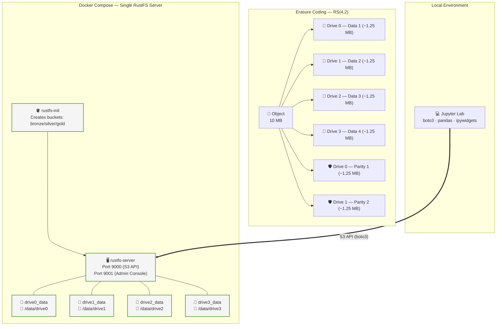

# 🪣 cdn-s3-lab: Object Storage & Data Lakehouse

### **The Practical Guide to Distributed Object Storage**
Explore the paradigm shift from HDFS to Object Storage, with hands-on labs covering Erasure Coding, fault tolerance, fragmentation, CDN edge caching, Reed-Solomon from scratch, performance benchmarking, and a production-grade Medallion Lakehouse — all running locally with Docker.


---

## 🎯 What is this repository?

A **hands-on lab** demonstrating the modern Object Storage paradigm. Where the Hadoop lab focused on HDFS (coupled compute+storage), this lab explores the decoupled architecture behind modern Data Lakes and Lakehouses.

- 📖 **Rich Documentation** — Theory-backed content on Object Storage, Erasure Coding (Reed-Solomon), fault tolerance, and fragmentation.
- ⚙️ **Single-Node RustFS Server** — A single S3-compatible storage server with **Erasure Coding** across 4 isolated drives, all running on your machine.
- 💻 **12 Interactive Labs** — From S3 basics to implementing Reed-Solomon from scratch and building a CDN edge cache layer.
- 🎛️ **Interactive Visualizer** — ipywidgets dashboard with click-to-fail drive buttons and live EC status.
- ☁️ **GitHub Codespaces Ready** — Open in the browser with zero local setup.

> **Target audience:** Data engineers, architects, and storage enthusiasts who want to understand how modern object storage systems handle durability, availability, and performance at scale.

---

## ⚡ Quick Start

### Option A — Local (Docker + uv)

```bash
# 1. Clone the repository
git clone https://github.com/hiltonmbr/cdn-s3-lab.git
cd cdn-s3-lab

# 2. Start the RustFS server (4 drives, Erasure Coding)
make up

# 3. Set up Python environment and launch the labs
make setup-env
make jupyter-lab
```

### Option B — GitHub Codespaces (zero local setup)

Click **Code → Open with Codespaces** on GitHub. The devcontainer starts RustFS automatically and launches Jupyter Lab.

---

Access the cluster once it is running:
- 👉 **[Admin Console](http://localhost:9001)** — credentials: `admin` / `adminpassword`
- 👉 **S3 API endpoint**: `http://localhost:9000`

Run `notebooks/00_setup_check.ipynb` to confirm your environment is ready before starting Lab 01.

---

## ⚙️ Prerequisites

| Requirement | Details |
|---|---|
| **Docker Engine** | Essential for running the RustFS cluster |
| **Docker Compose** | Bundled in Docker Desktop |
| **uv** | Fast Python package manager ([Installation](https://docs.astral.sh/uv/getting-started/installation/)) |
| **Make** | Used for terminal shortcuts (optional but recommended) |
| **Resources** | At least **4 GB RAM** recommended |
| **Disk** | A few GB free for datasets downloaded to `temp/` |

```bash
docker version && docker compose version && uv --version
```

---

## 🗺️ Learning Map

### 📖 Theory — Object Storage Fundamentals

Read the docs in `docs/` before the hands-on labs.

| # | Module | What you will learn |
|:---:|:---|:---|
| 1 | [The Object Storage Paradigm](docs/01-object-storage-paradigm.md) | Why compute-storage separation changed everything |
| 2 | [RustFS Architecture](docs/02-rustfs-architecture.md) | Peer-to-peer design, sets/stripes, S3 compatibility |
| 3 | [Data Lakehouse & Medallion](docs/03-data-lakehouse.md) | Bronze/Silver/Gold, ACID on object storage |
| 4 | [Erasure Coding & Reed-Solomon](docs/04-erasure-coding.md) | k/m/n parameters, storage efficiency, RS math |
| 5 | [Fault Tolerance & Self-Healing](docs/05-fault-tolerance.md) | Node/disk failure, read-time repair, background scrub |
| 6 | [Fragmentation & Multipart Upload](docs/06-multipart-fragmentation.md) | Object sharding, parallel upload, resume on failure |

---

### 🧪 Hands-on Labs

Open via `make jupyter-lab` or VS Code with the Jupyter extension. **Start with Lab 00** to validate your environment.

| # | Topic | Description |
|:---:|:---|:---|
| 00 | 🩺 **Environment Check** | Validates Python, packages, RustFS connectivity, and default buckets before Lab 01 |
| 01 | 🪣 **Boto3 Basics** | Connect to S3 API, list/create buckets, upload/download, presigned URLs |
| 02 | 🐼 **Pandas + Parquet (Intro)** | Simple Bronze→Silver→Gold pipeline with a 10-row synthetic dataset |
| 03 | 🧩 **Multipart Upload** | Upload large files in parallel, verify MD5 integrity, abort/resume |
| 04 | 🛡️ **Fault Tolerance Simulation** | Simulate drive failures via directory rename, verify EC reconstruction |
| 05 | 🔄 **Versioning & Lifecycle** | Object versioning, delete markers, restore, lifecycle rules |
| 06 | 📊 **Erasure Coding In Practice** | Multi-drive failures, storage overhead comparison, EC math |
| 07 | 🧮 **Reed-Solomon from Scratch** | Implement RS(4,2) in pure Python: GF(2⁸), Vandermonde matrix, encode/decode |
| 08 | ⚡ **Benchmarking** | PUT vs Multipart throughput, optimal part size, parallelism scaling — with charts |
| 09 | 🌐 **CDN Edge Cache** | Build `EdgeNode` + `CDNLayer` on top of RustFS: TTL, invalidation, hit/miss ratio |
| 10 | 🎛️ **Cluster Visualizer** | ipywidgets dashboard — click buttons to fail/restore drives, watch EC status live |
| 11 | 🏗️ **Data Lakehouse Roadmap** | Download 54K real records, inject quality issues, clean, partition Silver by cut, 4 Gold KPIs + dashboard |

> 💡 **Labs 07–11** are the advanced tier. Complete Labs 01–06 first to build the intuition that makes the advanced labs click.

---

## 🏗️ Project Structure

```
cdn-s3-lab/
├── .devcontainer/
│   └── devcontainer.json        # GitHub Codespaces / VS Code Dev Containers
├── .github/
│   └── workflows/
│       └── ci.yml               # CI: notebook-strip check + ruff lint
├── docs/                        # Theoretical modules (6 markdown files)
├── notebooks/                   # Interactive Jupyter labs (12 notebooks)
│   ├── 00_setup_check.ipynb
│   ├── 01_boto3_basics.ipynb
│   ├── ...
│   └── 11_datalake_roadmap.ipynb
├── scripts/
│   └── lab_utils.py             # Shared S3 client, bucket helpers, drive fail/restore utils
├── tests/
│   ├── test_lab_utils.py        # Unit tests (no RustFS required)
│   └── test_notebooks.py        # End-to-end notebook tests via nbmake
├── docker-compose.yml           # RustFS server (4 drives, Erasure Coding, bronze/silver/gold buckets)
├── Makefile                     # Convenience targets
├── pyproject.toml               # Python dependencies (boto3, pandas, pyarrow, ipywidgets, matplotlib)
└── temp/                        # Downloaded datasets — git-ignored
```

---

## 🏛️ Lab Architecture

A single RustFS server manages 4 independent Docker volumes (`drive0`…`drive3`) that form an RS(4,2) Erasure Coding set — simulating a real multi-disk object storage node.



### EC Fault Tolerance

| Failed drives | Surviving shards | Status |
|---|---|---|
| 0 | 6 / 6 | ✅ Healthy |
| 1 | 5 / 6 | ⚠️ Degraded — EC reconstructs transparently |
| 2 | 4 / 6 = k | ⚠️ Degraded — at the RS(4,2) limit, still recoverable |
| 3+ | < k | ❌ Unrecoverable |

### RS(4,2) vs Alternatives

| Scheme | Storage efficiency | Drives lost tolerance |
|---|---|---|
| 3× Replication | 33 % | 2 |
| **RS(4,2)** (this lab) | **67 %** | **2** |
| RS(6,2) | 75 % | 2 |
| RS(10,4) | 71 % | 4 |

---

## 📝 Makefile Reference

```bash
# ── Server ────────────────────────────────────────────────────────
make up              # Start RustFS (4 drives, Erasure Coding)
make down            # Stop the server
make clean           # Destroy containers, volumes, and temp/ data
make clean-data      # Wipe only temp/ downloads
make status          # Show running containers
make shell-server    # Open a shell inside rustfs-server

# ── Python Environment ────────────────────────────────────────────
make setup-env       # Create .venv with uv, register Jupyter kernel, configure nbstripout

# ── Notebooks ─────────────────────────────────────────────────────
make jupyter-lab     # Launch Jupyter Lab
make strip           # Strip all notebook outputs (run before committing)

# ── Quality ───────────────────────────────────────────────────────
make check           # Verify all notebooks are output-stripped (CI gate)
make lint            # Run ruff linter on scripts/ and notebooks/
make test            # Run pytest + nbmake end-to-end notebook tests (requires make up)
```

---

## 🧪 Running Tests

```bash
# Unit tests (no RustFS required)
uv run pytest tests/test_lab_utils.py -v

# Full notebook tests (RustFS must be running)
make up
make test
```

CI runs `make check` and `make lint` on every push via GitHub Actions (`.github/workflows/ci.yml`).

---

## 📄 License and References

This project is made available under the [MIT License](LICENSE).

> **Open educational material.** Created for the hands-on classes of the **Data Science for Business** course (UFPB). Developed by Hilton Martins.

### References

- [RustFS Official Documentation](https://docs.rustfs.com)
- [Amazon S3 API Reference](https://docs.aws.amazon.com/AmazonS3/latest/API/Welcome.html)
- [Boto3 Documentation](https://boto3.amazonaws.com/v1/documentation/api/latest/index.html)
- [Apache Arrow / Parquet](https://parquet.apache.org)
- [The Data Lakehouse Architecture (Databricks)](https://www.databricks.com/blog/2020/01/30/what-is-a-data-lakehouse.html)
- [Reed-Solomon Erasure Coding — Backblaze](https://www.backblaze.com/blog/reed-solomon/)
