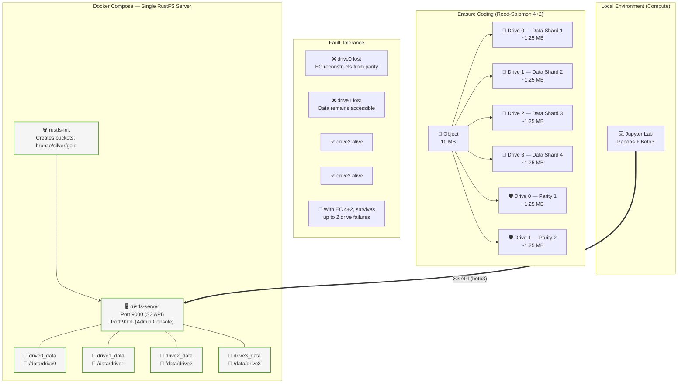

# 🪣 Object Storage Lab: RustFS & Erasure Coding

### **The Practical Guide to Distributed Object Storage**
Explore the paradigm shift from HDFS to Object Storage, with hands-on labs covering Erasure Coding, fault tolerance, fragmentation, and the Medallion Lakehouse architecture — all running locally with Docker.


---

## 🎯 What is this repository?

A **hands-on lab** demonstrating the modern Object Storage paradigm. Where the Hadoop lab focused on HDFS (coupled compute+storage), this lab explores the decoupled architecture behind modern Data Lakes and Lakehouses.

- 📖 **Rich Documentation** — Theory-backed content on Object Storage, Erasure Coding (Reed-Solomon), fault tolerance, and fragmentation.
- ⚙️ **Single-Node RustFS Server** — A single S3-compatible storage server with **Erasure Coding** across 4 isolated drives, all running on your machine.
- 💻 **Interactive Labs** — Practice S3 API, Pandas integration, multipart uploads, fault injection, and more via Jupyter notebooks.

> **Target audience:** Data engineers, architects, and storage enthusiasts who want to understand how modern object storage systems handle durability, availability, and performance at scale.

---

## ⚡ Quick Start (5 minutes)

You need `docker`, `make`, and `uv` installed:

```bash
# 1. Clone the repository
git clone https://github.com/hiltonmbr/cdn-s3-lab.git
cd cdn-s3-lab

# 2. Start the single-node RustFS server (Erasure Coding enabled)
make up

# 3. Set up Python environment and launch the labs
make setup-env
make jupyter-lab
```

Your browser will open with the interactive notebooks in the `notebooks/` folder. Select `.venv` as the Python kernel.

Access the cluster:
- 👉 **[Admin Console](http://localhost:9001)** — credentials: `admin` / `adminpassword`
- 👉 **S3 API endpoint**: `http://localhost:9000`

---

## ⚙️ Prerequisites

| Requirement | Details |
|---|---|
| **Docker Engine** | Essential for instantiating the cluster in an isolated manner |
| **Docker Compose** | Already bundled in Docker Desktop |
| **Make (optional)** | Used for terminal shortcuts |
| **uv** | Fast Python package installer and resolver ([Installation](https://docs.astral.sh/uv/getting-started/installation/)) |
| **Resources** | At least **4GB RAM** recommended |
| **Disk** | A few GB free for labs 3–6 (datasets are downloaded to `temp/`) |

Verify the vital tools:

```bash
docker version
docker compose version
uv --version
```

---

## 🗺️ Learning Map

### 📖 Theory: Object Storage Fundamentals
Read the documentation in the `docs/` folder before the hands-on practice.

| # | Theoretical Module | What you will learn | Link |
|:---:|:---|:---|:---:|
| 1 | **The Object Storage Paradigm** | Why compute-storage separation changed everything | [📖 Read](docs/01-object-storage-paradigm.md) |
| 2 | **RustFS Architecture** | Peer-to-peer design, sets/stripes, S3 compatibility | [📖 Read](docs/02-rustfs-architecture.md) |
| 3 | **Data Lakehouse & Medallion** | Bronze/Silver/Gold, ACID on object storage | [📖 Read](docs/03-data-lakehouse.md) |
| 4 | **Erasure Coding & Reed-Solomon** | k/m/n parameters, storage efficiency, math behind EC | [📖 Read](docs/04-erasure-coding.md) |
| 5 | **Fault Tolerance & Self-Healing** | Node/disk failure, read-time repair, background scrub | [📖 Read](docs/05-fault-tolerance.md) |
| 6 | **Fragmentation & Multipart Upload** | Object sharding, parallel upload, resume on failure | [📖 Read](docs/06-multipart-fragmentation.md) |

### 🧪 Hands-on Labs: Getting Your Hands Dirty
Labs are inside the `notebooks/` folder. Open them via `make jupyter-lab` or VS Code with the Jupyter extension.

| # | Topic | Description | Link |
|:---:|:---|:---|:---:|
| 1 | 🪣 **Boto3 Basics** | Connect to S3 API, list/create buckets, upload/download objects | [🧪 Go to Lab](notebooks/01_boto3_basics.ipynb) |
| 2 | 🐼 **Pandas + Parquet (Medallion)** | Bronze→Silver→Gold pipeline using Pandas and Parquet | [🧪 Go to Lab](notebooks/02_pandas_s3fs_parquet.ipynb) |
| 3 | 🧩 **Multipart Upload & Fragmentation** | Upload large files in parallel, inspect parts, abort/resume | [🧪 Go to Lab](notebooks/03_multipart_upload.ipynb) |
| 4 | 🛡️ **Fault Tolerance Simulation** | Stop a node, verify data integrity via Erasure Coding | [🧪 Go to Lab](notebooks/04_fault_tolerance.ipynb) |
| 5 | 🔄 **Versioning & Lifecycle** | Object versioning, delete/restore, lifecycle rules | [🧪 Go to Lab](notebooks/05_versioning.ipynb) |
| 6 | 📊 **Erasure Coding In Practice** | Simulate multi-node failures, compare storage efficiency | [🧪 Go to Lab](notebooks/06_erasure_coding.ipynb) |

> 💡 **Labs 3–6** demonstrate advanced object storage features. Each notebook starts with small examples so you can validate the flow before scaling up.

---

## 🏗️ Lab Architecture

A single RustFS server manages 4 independent Docker volumes (`drive0`…`drive3`) that together form an Erasure Coding set — simulating a real multi-disk object storage node.

```
📁 cdn-s3-lab/
├── docker-compose.yml   → 1 server, 4 drives, Erasure Coding
├── notebooks/           → Interactive Jupyter labs
├── docs/                → Theoretical fundamentals
├── Makefile             → Convenience shortcuts
└── temp/                → Temporary downloads & datasets (git-ignored)
```



### Key Architectural Decisions

| Decision | Why |
|---|---|
| **4 drives** | Minimum for meaningful Erasure Coding (4+2 scheme) |
| **Docker volumes** | Each drive is a named volume — isolated and durable |
| **Single server** | No load balancer needed; RustFS handles the full S3 API natively |
| **Erasure Coding inline** | Every write is EC-encoded across all 4 drives; no separate process needed |

### 🆚 Single-Drive vs Erasure Coding (EC 4+2)

| Aspect | Single Drive (no EC) | Erasure Coding (4+2) |
|---|---|---|
| **Storage efficiency** | 100% (1 GB stored → 1 GB used) | 66% (1 GB stored → 1.5 GB used) |
| **Fault tolerance** | 0 drive failures | Up to 2 drive failures |
| **Durability** | Single point of failure | Survives simultaneous loss of any 2 drives |
| **Performance (write)** | Direct write | EC encoding adds ~15–30% CPU overhead |
| **Performance (read)** | Direct read | Read-time repair if drives are degraded |
| **Cost** | Lower storage cost | Higher storage cost, lower rebuild cost |
| **Use case** | Dev/test, ephemeral data | Production, regulatory compliance, critical data |

---

## 📝 Lab Administration Cheatsheet

```bash
# ── Server Orchestration ──
make up              # 🔥 Start the RustFS server (4 drives, Erasure Coding)
make down            # 😴 Stop the server
make clean           # 💥☢️ Nuke containers + volumes + local data
make clean-data      # 🧹 Wipe only temp/ downloads
make status          # 📡 Show running containers

# ── Accessing Terminal ──
make shell-server    # 🐚 rustfs-server shell

# ── Running Notebooks Locally ──
make setup-env       # 🐍 Create Python environment with uv
make jupyter-lab     # 📓🚀 Start Jupyter Lab
make strip           # 🧹 Strip notebook outputs (commit-safe)
```

---

## 📄 License and References

This project is made available under the [MIT License](LICENSE).

> **Open educational material.** Created for the hands-on classes of the **Data Science for Business** course (UFPB). Developed by Hilton Martins.

### References

- [RustFS Official Documentation](https://docs.rustfs.com)
- [Amazon S3 API Reference](https://docs.aws.amazon.com/AmazonS3/latest/API/Welcome.html)
- [Boto3 Documentation](https://boto3.amazonaws.com/v1/documentation/api/latest/index.html)
- [Apache Arrow / Parquet](https://parquet.apache.org)
- [The Data Lakehouse Architecture (Databricks)](https://www.databricks.com/blog/2020/01/30/what-is-a-data-lakehouse.html)
