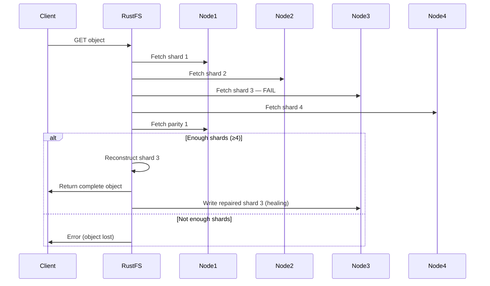

# 🛡️ Fault Tolerance & Self-Healing

One of the key advantages of distributed object storage is the ability to survive hardware failures without data loss or downtime. RustFS achieves this through a combination of **Erasure Coding**, **automatic healing**, and **decentralized architecture**.

## Failure Scenarios

### 1. Single Node Failure

If one node in a 4-node RS(4,2) cluster goes down:
- The remaining 3 nodes still hold a subset of shards
- As long as at least **k=4 shards** survive across the cluster, all data is recoverable
- With 4 nodes and RS(4,2), each node holds roughly 1/6 of total shards — losing 1 node still leaves 5/6 of shards intact
- **Result:** No data loss. Reads and writes continue transparently.

### 2. Multiple Node Failures

With RS(4,2):
- Any **2 nodes** can fail simultaneously with no data loss
- Beyond 2 nodes, some data may become unavailable (but not necessarily corrupted — depends on which shards survived)

### 3. Disk (Drive) Failure

If a single disk fails within a multi-disk node:
- Only shards on that specific disk are lost
- EC reconstruction uses shards from other disks (possibly on other nodes)
- **Result:** No data loss. Trigger healing to restore missing shards to a new disk.

### 4. Bit Rot (Silent Data Corruption)

Data on disks can silently corrupt over time (bit rot). RustFS protects against this via:
- **Inline checksums:** Every shard has a Blake3 hash verified on every read
- **Background scrub:** Periodic scanning detects and repairs bit rot automatically

## Self-Healing Mechanisms

RustFS has three levels of self-healing:

| Level | Trigger | Description |
|---|---|---|
| **Read-time repair** | Every GET/HEAD request | If a shard fails checksum, RustFS reconstructs it from other shards inline and returns the correct data |
| **Background scrub** | Periodic scheduler | Traverses 1/1024 of objects per cycle, verifies checksums, repairs silently |
| **Manual healing** | `rc admin heal` command | Full scan of the storage pool, repairs all inconsistencies |

### Healing Process



## Testing Fault Tolerance in the Lab

In lab 4, you will simulate drive failures at the **shard level** by renaming
the drive directory inside the running container. This forces RustFS to return
`ENOENT` on the next path lookup, which is a more reliable failure signal than
`chmod 000` (a cached open file descriptor would bypass permission changes).

```bash
# Simulate drive failure: rename dir so shard lookups fail with ENOENT
docker exec rustfs-server mv /data/drive1/lab4-ft /data/drive1/lab4-ft_FAILED

# Restore: rename back
docker exec rustfs-server mv /data/drive1/lab4-ft_FAILED /data/drive1/lab4-ft
```

Steps:
1. Upload files to the cluster (normal operation)
2. Fail one drive directory — reads still succeed (5/6 shards, EC reconstructs)
3. Fail a second drive — reads still succeed (4/6 shards, exactly at RS(4,2) limit)
4. Fail a third drive — reads fail (3/6 shards < k=4, data unrecoverable)
5. Restore all drives — healing kicks in, all objects become readable again

## Best Practices for Production

- **Monitor** node health and healing status
- **Replace failed disks** promptly to restore full redundancy
- **Run periodic** `rc admin heal` during low-traffic windows
- **Configure alerts** on healing failures or degraded cluster state
